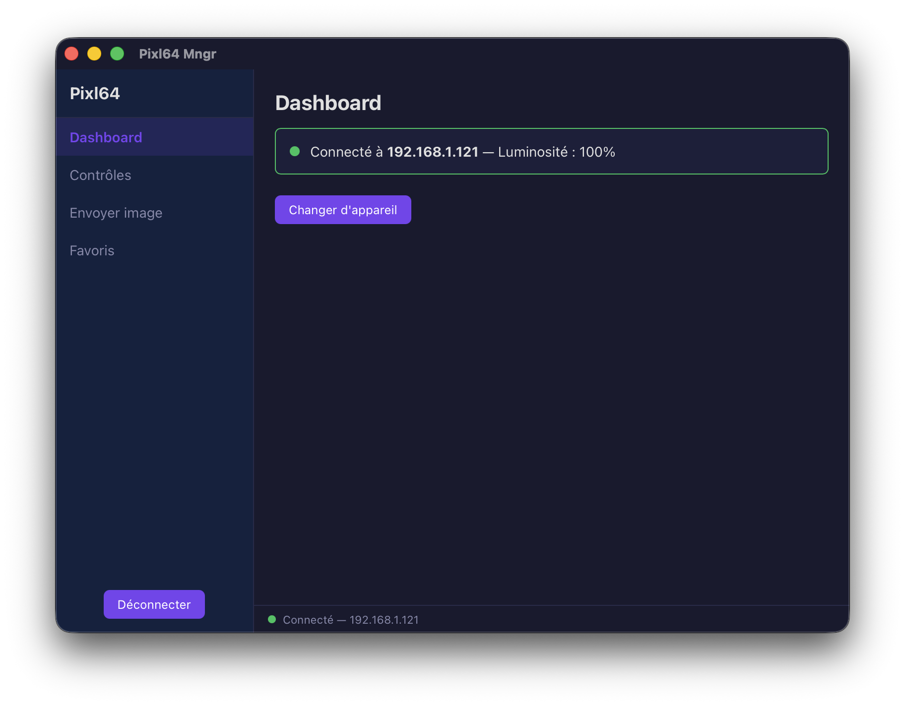
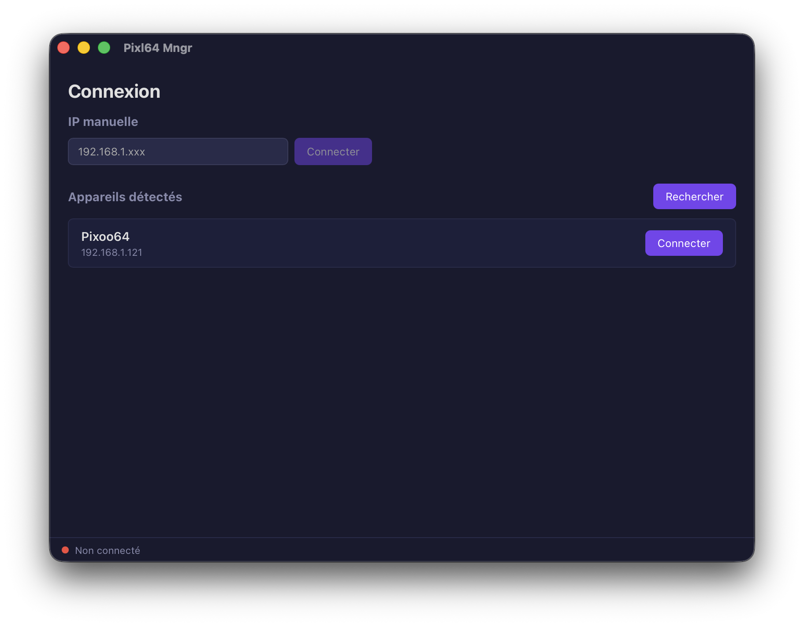
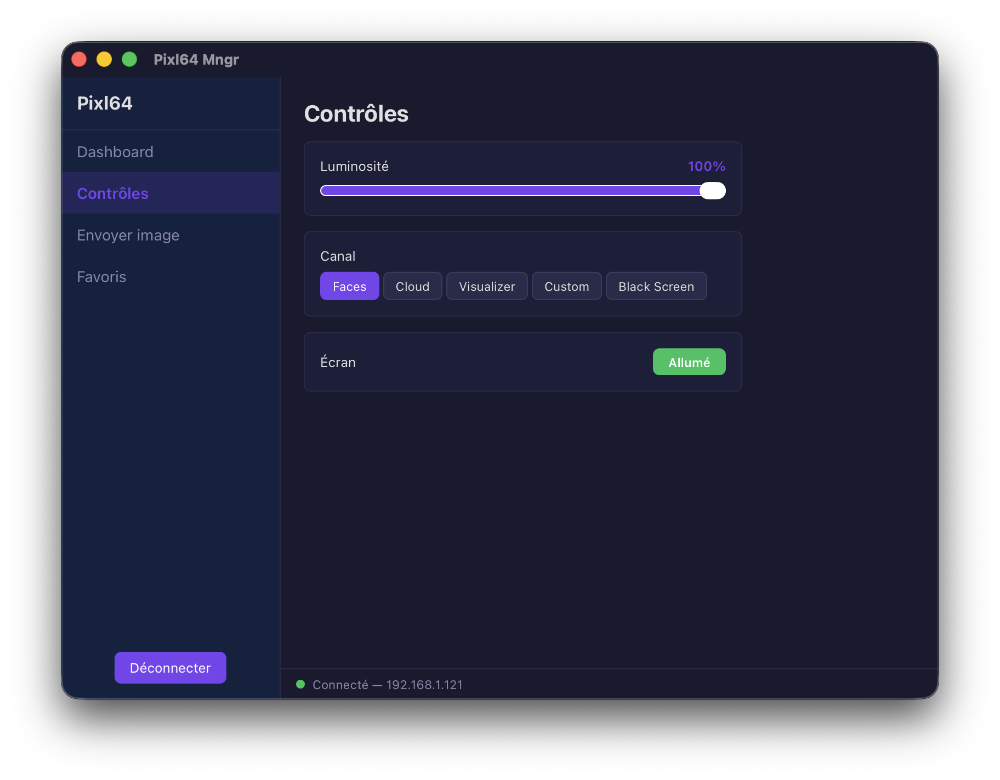
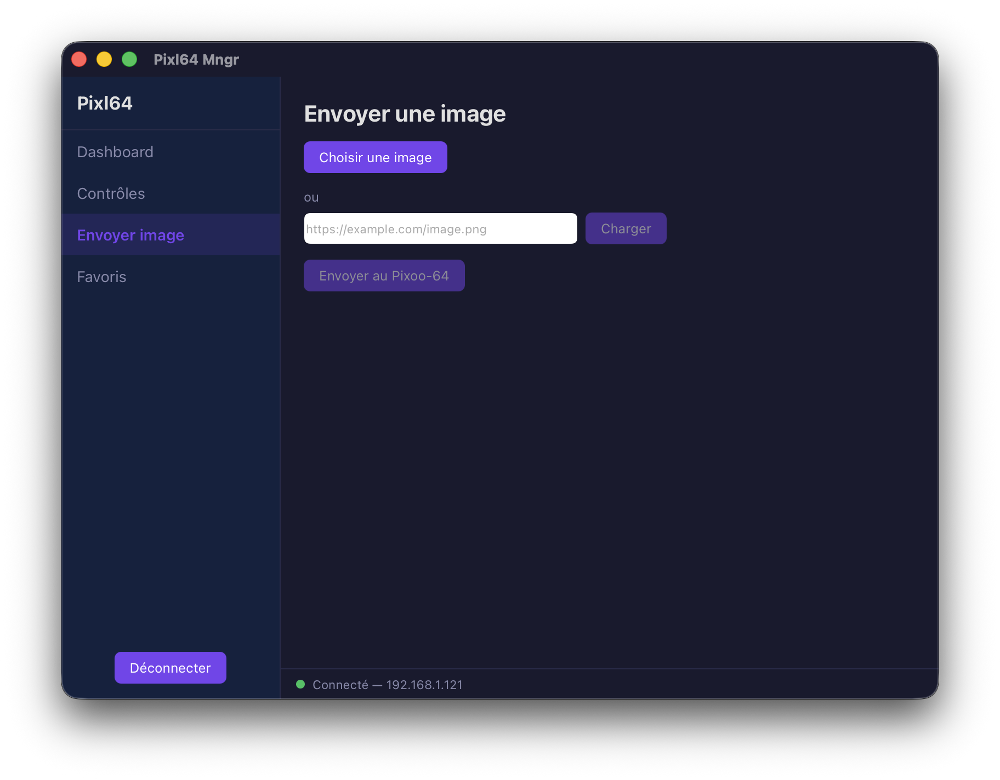
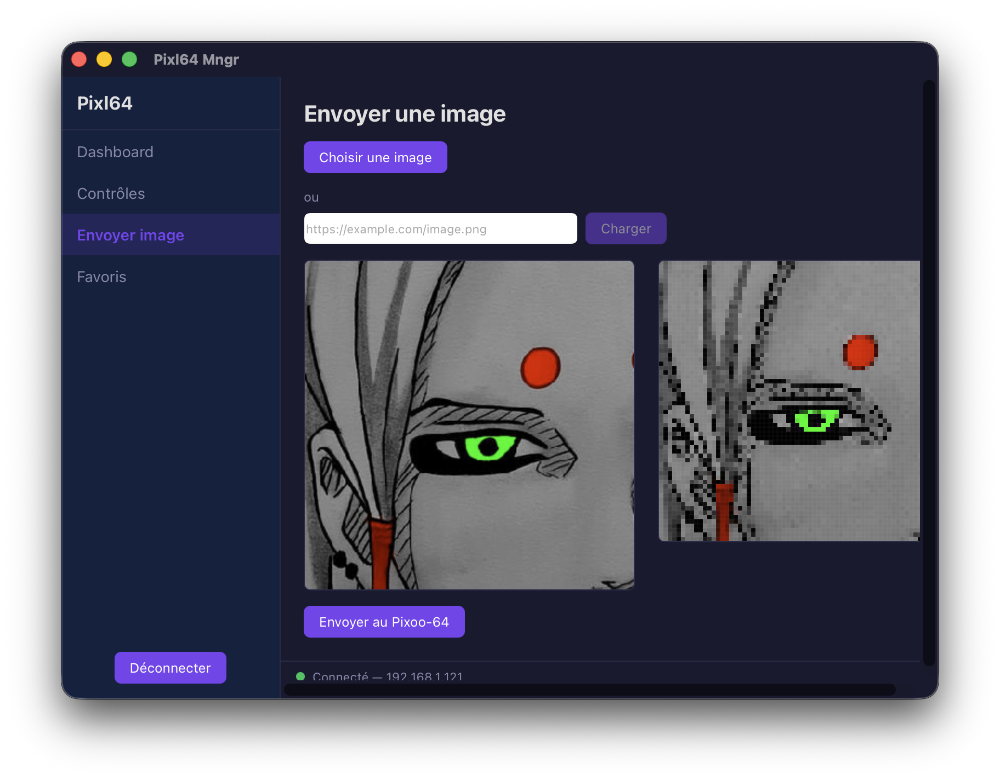
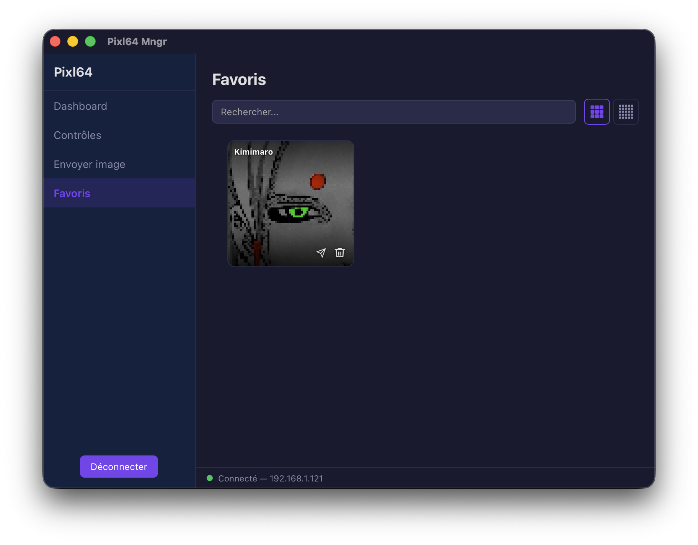

<div align="center">

# Pixl64 Mngr

**Cross-platform desktop app to control your Divoom Pixoo-64 LED panel.**

[](https://github.com/Cariboucolas/pixl64-mngr/actions/workflows/ci.yml)
[](https://github.com/Cariboucolas/pixl64-mngr/releases)
[](LICENSE)
[](https://tauri.app)
[](https://vuejs.org)
[](https://www.rust-lang.org)

<!-- TODO: ajouter screenshot principal hero ici -->
<!--  -->

</div>

---

## Why

Divoom only ships a mobile app for the Pixoo-64. **Pixl64 Mngr** is a native desktop alternative — built for users who want to control the panel from their workstation, send custom images quickly, and keep a local library of favorites without going through the cloud.

## Features

- 🔍 **Auto-discovery** of Pixoo-64 devices on your local network
- 🔌 **Manual IP connection** as fallback
- 🎛️ **Device controls** — brightness, channel, power
- 🖼️ **Send custom images** — local files or URL import, with pan/zoom cropping
- ⭐ **Favorites library** — save, search and re-send your best images
- 🌐 **URL import with security** — defense-in-depth (TS + Rust + Tauri capabilities)

## Installation

Pre-built binaries are available on the [Releases page](https://github.com/Cariboucolas/pixl64-mngr/releases).

| OS | Download | Notes |
|---|---|---|
| **macOS** | `Pixl64-mngr-X.Y.Z.dmg` | Universal (Intel + Apple Silicon) |
| **Linux** | `pixl64-mngr_X.Y.Z_amd64.deb` or `.AppImage` | x86_64 |
| **Windows** | `Pixl64-mngr_X.Y.Z_x64.msi` | x86_64 |

> **First launch on macOS / Windows** — the app is not yet code-signed. macOS will show "unidentified developer"; right-click → Open. Windows SmartScreen → "More info" → "Run anyway".

## Quick start

1. **Plug** your Divoom Pixoo-64 to power and Wi-Fi (same network as your computer)
2. **Launch** Pixl64 Mngr → click "Discover devices" → select yours
3. **Send an image** → upload a file or paste an image URL → crop → click "Send"

## Screenshots

| Discovery | Connection | Dashboard |
|---|---|---|
|  |  |  |

| Send image | Cropper | Favorites |
|---|---|---|
|  |  |  |

## Tech stack

| Layer | Tech | Rationale |
|---|---|---|
| Shell | [Tauri 2](https://tauri.app) | Native desktop, tiny binaries, Rust backend |
| Frontend | [Vue 3](https://vuejs.org) + [TypeScript](https://www.typescriptlang.org) | Composition API, strict typing |
| State | [Pinia](https://pinia.vuejs.org) | Vue-native store with persistence |
| Backend | [Rust](https://www.rust-lang.org) | URL validation, HTTP proxy for image fetch |
| Tests | [Vitest](https://vitest.dev) + `cargo test` | Unit tests both sides |
| Lint/format | [Biome](https://biomejs.dev) + `rustfmt` + `clippy` | Single tool for JS/TS |

## Security architecture

Image imports go through a **3-layer defense-in-depth** stack:

```
URL → [Vue validateImageUrl]       (UX pre-filter, rejects SSRF/non-https)
    → [Rust fetch_image_bytes]     (re-validates, 10s timeout, content-type, size limit)
    → [Tauri http capabilities]    (OS-level allowlist: Divoom LAN + cloud only)
```

A SSRF/XSS escape would have to defeat all three independent layers. Image fetch from arbitrary URLs runs in Rust (`reqwest` with `rustls-tls`), not in the JS context.

## Development

### Prerequisites

- [Node.js](https://nodejs.org) ≥ 22.12 and [pnpm](https://pnpm.io) ≥ 10
- [Rust](https://www.rust-lang.org) stable
- Tauri system deps — see [official guide per OS](https://tauri.app/start/prerequisites/)

### Setup

```bash
pnpm install
pnpm tauri dev
```

### Tests

```bash
# Frontend
pnpm test           # vitest run
pnpm test:watch     # watch mode

# Backend
cd src-tauri && cargo test
```

### Lint / format

```bash
pnpm check           # biome check
pnpm check:fix       # biome auto-fix
cd src-tauri && cargo fmt && cargo clippy
```

### Project layout

```
src/                      # Vue 3 + TypeScript frontend
├── components/           # UI components
├── pages/                # Route pages
├── services/divoom/      # Divoom API client + helpers
└── stores/               # Pinia stores

src-tauri/                # Rust backend
├── src/commands/         # Tauri commands (invoke from JS)
├── capabilities/         # Tauri permission scopes
└── tauri.conf.json       # App config

tests/                    # Vitest tests (frontend)
.github/workflows/        # CI + Release pipelines
```

## Contributing

PRs welcome. The codebase follows TDD — write tests first.

1. Fork and create a feature branch
2. Add tests in `tests/` or as `#[cfg(test)]` modules
3. Run `pnpm check && pnpm test` and `cargo clippy && cargo test` locally
4. Open a PR — CI will run the same checks

## License

[MIT](LICENSE) © 2026 Colas Durcy

## Acknowledgments

- [Divoom](https://divoom.com) — for the Pixoo-64 hardware (this project is not affiliated with Divoom)
- [Tauri](https://tauri.app) — the desktop framework that makes this possible
- Community reverse-engineering of the [Divoom HTTP API](https://docin.divoom-gz.com/web/#/12/79)
